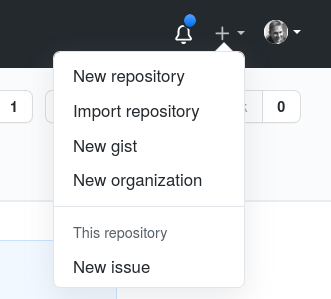
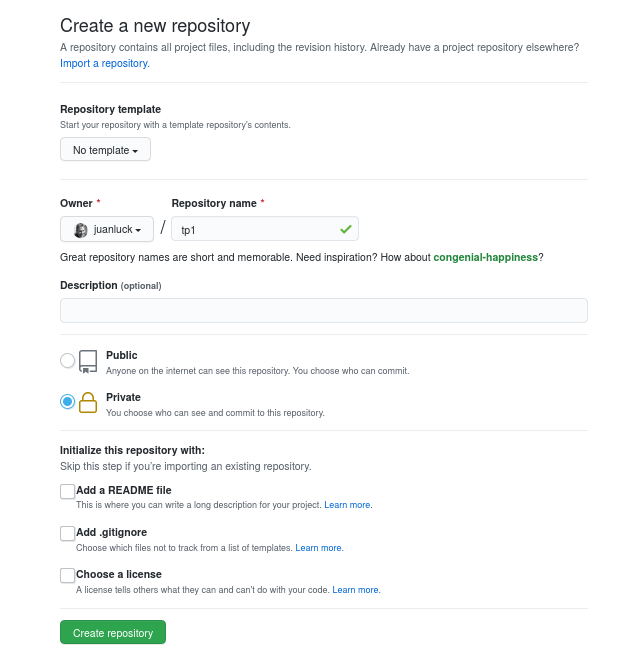

<a id='TP2'></a>
# TP 2 : Travailler en autonomie sur un depôt github distant 
[Retour à la page principale](../index.md)


Jusqu'à présent (dans le [TP1](../tp1/index.md)), nous avons travaillé sur un dépôt local. Cependant, le vrai pouvoir de git est de pouvoir travailler avec un dépôt distant (ou plateforme de gestion de projet, généralement hébergé sur un serveur externe), ce qui présente les avantages suivants: i) avoir une copie de sauvegarde du projet, ii) possibilité d'accéder au projet depuis différentes machines et iii) possibilité de travailler en équipe sur le même projet. 

Dans ce TP, nous allons travailler de manière autonome (il n'y a toujours pas de travail d'équipe) sur un référentiel distant. Vous connaissez sûrement déjà certaines de ces plateformes de gestion de projet : il en existe plusieurs. **Les plus connues :**

[Github](https://github.com) :
:	La plateforme la plus connue. Héberge gratuitement des projets. Souscriptions pour plus de fonctionalités. Le code est hébergé chez github.

[Bitbucket](https://bitbucket.org) : 
:    Similaire à GitHub. Programme étudiant (avec l’email universitaire). Le code est hébergé par Atlasian.

[Gitlab](https://about.gitlab.com/) :
:    Similaire aux précédents dans sa version commerciale (Entreprise Edition). Une version open source (Community Edition) permet l’installation privée d’un serveur.

---

## Objectifs du TP 2

Le but de ce deuxième TP  est de commencer à travailler en autonomie (pas de travaille en équipe pour l'instant) avec un dépôt git distant. En particulier, nous travaillerons avec le système github. Dans ce TP, nous allons apprendre: 

>1. [Créer un compte sur github](#github)
2. 

---

<a id='github'></a>
## 1. Créer un compte sur github 

Peut-être que certains d'entre vous avez déjà un compte github. Si tel est le cas, vous pouvez ignorer cette première étape. Sinon, créer un compte sur github est simple : 

1. Vous devez aller sur [github](https://github.com) et cliquer sur **sign up** pour vous insrire : 


2. Ensuite, vous devez remplir les champs suivants du formulaire. Prenez quelques minutes pour créer un compte. 


### 1.1. Pousser un dépôt existant depuis la ligne de commande 





Under **repository name** type **tp1** and leave the rest of the fields empty (as shown in the image). You can choose your repository to be **public** or **private**.


```shell
cd existing_repo
git remote -v
git branch
*master
git remote add origin https://github.com/<votre_utilisateur>/tp1.git
git push -u origin master
```

### 1.2. Cloner un dépôt distant sur notre machine locale 

```java
public class Cryptomonnaie{
    private String nom;
    private double valeurDeJeton ;

    public Cryptomonnaie(String nom, double valeurDeJeton){
        this.nom = nom;
        this.valeurDeJeton = valeurDeJeton;
    }

    public String getNom() {
        return nom;
    }

    public double getValeurDeJeton() {
        return valeurDeJeton;
    }

    @Override
    public String toString() {
        return nom+":"+valeurDeJeton;
    }
}
```