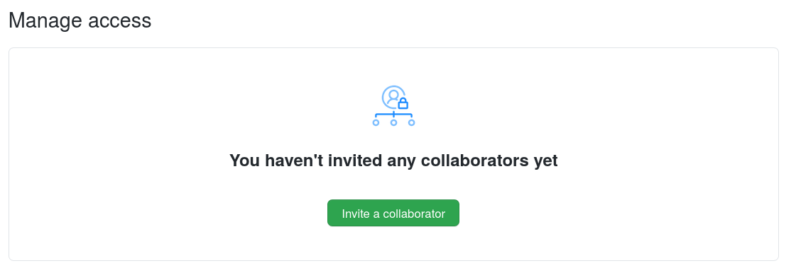

<a id='TP3'></a>
# TP 3 : Travailler en équipe sur un depôt github distant 
[Retour à la page principale](../index.md)

Il est temps de commencer à utiliser git pour le travail d'équipe. En fait, git a été initialement conçu dans ce but et c'est là qu'il peut nous montrer sa puissance. 

Avant de continuer, nous allons nous organiser en binômes. Si vous êtes un nombre impair, un équipe peut être composé de trois personnes malgré le TP est conçu pour deux roles. 

**Êtes-vous déjà constitué en équipe ?** Lancez une pièce et décidez qui assumera le rôle de <mark style="background-color:red;font-weight:bold; color:white">Athos</mark> et qui assumera le rôle de <mark style="background-color:green;font-weight:bold; color:white">Porthos</mark> pour ce travail pratique. Si vous êtes trois, deux personnes seront regroupées dans le rôle d'<mark style="background-color:red;font-weight:bold; color:white">Athos</mark>.

 
---

## Objectifs du TP 3

Le but de ce troisième TP  est de commencer à travailler en équipe sur github et développer un marché pour le projet de crypto-monnaie que nous avions déjà lancé. Dans ce TP, nous allons apprendre à : 

>1. [Inviter des collaborateurs dans un dépôt personnel ](#collaborateurs)
2. [Pousser un dépôt existant depuis la ligne de commande](#pushremote)
3. [Séquence de travail avec un dépôt distant](#sequence)
4. [Cloner un dépôt distant sur notre machine locale](#clone)
   

[Haut de la page](#TP3)

---

<a id='collaborateurs'></a>
## 1. Inviter des collaborateurs dans un dépôt personnel

<mark style="background-color:red;font-weight:bold; color:white">Athos</mark> :
---
: * Pour commencer, <mark style="background-color:red;font-weight:bold; color:white">Athos</mark> va créer un nouveau dépôt dans son compte github appelé `tp3` (<mark style="background-color:green;font-weight:bold; color:white">Porthos</mark> fera bien de regarder et de commenter avec <mark style="background-color:red;font-weight:bold; color:white">Athos</mark> comment cela est fait). Nous allons remplir le formulaire de la même manière que nous l'avons fait avec le dépôt `tp2`.

: * Une fois le dépôt créé, cliquez sur **Settings** :


: * Ensuite sur **Manage access** et puis sur **Invite a collaborator** :



: * demandez à <mark style="background-color:green;font-weight:bold; color:white">Porthos</mark> son nom d'utilisateur sur github et invitez-le dans votre référentiel :


<mark style="background-color:green;font-weight:bold; color:white">Porthos</mark> :
---

: * <mark style="background-color:green;font-weight:bold; color:white">Porthos</mark>  doit aller dans sa boîte email pour recevoir l'invitation d'<mark style="background-color:red;font-weight:bold; color:white">Athos</mark> à collaborer dans le dépôt `tp3` et l'accepter.

<mark style="background-color:red;font-weight:bold; color:white">Athos</mark>  et <mark style="background-color:green;font-weight:bold; color:white">Porthos</mark> :
---

: * Chacun de vous peut faire un clone du projet en se plaçant dans le répertoire `courseGIT` :

```shell
$:~/courseGIT> git clone https://github.com/<votre_utilisateur>/tp3.git
```
: * Si vous l'avez bien fait, votre répertoire `courseGIT` devrait contenir trois répertoires comme indiqué ci-dessous :

```shell
$:~/courseGIT> ls
tp1 tp2 tp3
```

### Exercices
>1. <mark style="background-color:green;font-weight:bold; color:white">Porthos</mark> : allez dans le répertoire `tp3` et mettez à jour tous les fichiers avec ceux du répertoire `tp2` (README.md et src/Cryptomonnaie.java) (surtout ne copiez pas le répertoire caché .git). Synchronisez les dépôts local et distant.
2.  <mark style="background-color:red;font-weight:bold; color:white">Athos</mark> : après que <mark style="background-color:green;font-weight:bold; color:white">Porthos</mark> vous en informe, faissez un `git pull` depuis votre répertoire local `tp3` pour synchroniser les changements.
3. Les deux : vérifiez que tous les dépôts sont bien synchronisés (ce qui est sur github correspond bien à ce que vous avez dans votre répertoire local).

[Haut de la page](#TP3)

-----