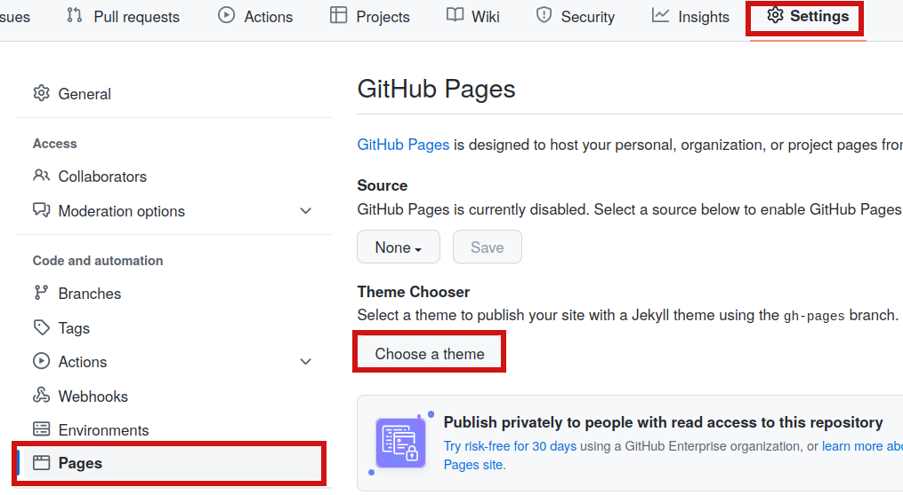
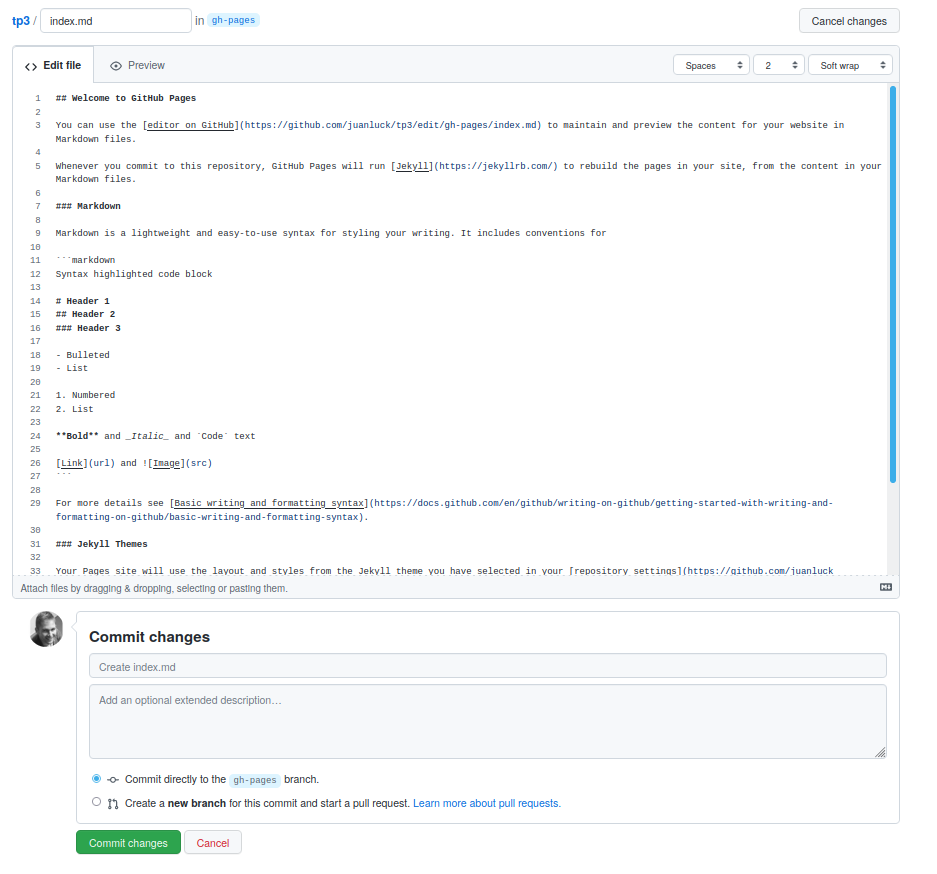
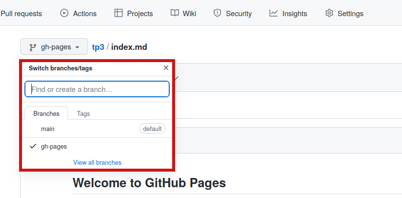

<style>
.note {
  min-height: 17px;
  margin: 4px 0 2px;
    margin-bottom: 2px;
  font-size: 12px;
  color: #000000;
  font-size: 14px !important;
  padding: 16px !important;
  margin-bottom: 24px !important;
  border-color: #000000; !important;
  background-color: rgba(84,174,255,0.4); !important;
  border-radius: 4px !important;
  border: 1px solid #000000; !important;
}

img[alt=drawing] { width: 200px; }
</style>

<a id='TP5'></a>
# TP 5 : Comment créer un site Web sur GitHub pages
[Retour à la page principale](../index.md)


---

## Objectifs du TP 5

Avec les [pages Github](https://pages.github.com/), GitHub vous permet d'héberger une page Web à partir d'un référentiel. Dans ce TP, nous allons apprendre à :

>1. [Créer un site Web pour un référentiel](#creation-web)
2. [Ajouter du contenu à l'aide de Markdown et HTML](#markdown)
3. [Créer un site Web pour la SAE 2.03](#sae)

   

[Haut de la page](#TP5)

---

<a id='creation-web'></a>
## 1. Créer un site Web pour un référentiel existant 

Parmi de nombreuses autres fonctionnalités, github vous permet d'héberger des sites Web dans l'extension github.io. Ce même cours en est un exemple : le site [https://juanluck.github.io/Introduction-GIT](https://juanluck.github.io/Introduction-GIT) n'est rien de plus qu'un dépôt github rendu public sous la forme d'un site web.

Il existe de nombreuses raisons pour lesquelles nous pourrions souhaiter avoir un site Web hébergé sur github : l'hébergeur est gratuit, la plate-forme est bien connue et elle peut même être utilisée comme site Web personnel. De plus, la mise à jour du contenu et le workflow se fait facilement grâce aux commandes que l'on connait déjà : il suffit de cloner un référentiel, de modifier localement le contenu souhaité, de le valider (```git commit```) et de  mettre à jour le site (```git push```). Ne vous inquiétez pas, nous verrons cela étape par étape.

Dans cette section, nous allons créer une page Web associée à un référentiel existant. Pour cela nous suivrons les étapes suivantes :

-  Aller sur votre dépôt github du **tp3**. Ce référentiel est à retrouver sur le site ```https://github.com/<votre-utilisateur-github>/tp3```

- Si nous voulons publier une page Web associée à ce référentiel, nous aurons besoin qu'il soit publique (sauf si vous avez un compte github premium). Pour cela, allez sur **Settings** et puis, en bas de page cliquez sur **Change visibility** puis sur **Make public**.

- Encore en **Settings** cliquez sur **Pages** comme dans l'image ci-dessous, puis sur **Choose a theme** :



- Sélectionnez un des thèmes puis cliquez sur **Select theme** :


- Cette action vous amènera à un autre écran où vous allez créer un fichier **index.md** par défaut. Ce fichier sera votre page d'accueil. Cliquez sur **Commit changes** :



- Quelque chose d'intéressant qui vient de se passer est que le référentiel a maintenant deux branches, la branche ```gh-pages``` (où nous aurons le contenu Web) et la branche principale ```main``` (où nous continuons à avoir notre code):



- Maintenant que nous avons la nouvelle branche ```gh-pages``` dans le référentiel distant sur github, ce que nous devons faire est de la mettre à jour dans notre répertoire local. Pour ce faire :

    - Allons au répertoire **tp3** de notre machine (dépôt local). Si nous ne trouvons pas ce répertoire, une autre option consiste à cloner à nouveau le référentiel github.
    - La commande qui nous permet de récupérer la branche distante est ```git fetch```. Tapez :
    ```
        $ git fetch origin gh-pages
    ```
    - Ensuite, pour passer localement à la branche ```gh-pages```, tapez :
    ```
        $ git checkout gh-pages
    ```

#### Vérification du contenu Web par défaut
 
 Si vous êtes déjà dans la branche ```gh-pages``` du répertoire local, vous pouvez voir qu'il existe un fichier ```index.md``` qui contient le contenu Web écrit en markdown. Ce contenu est publiquement accessible sur le site ```https://<votre-utilisateur-github>.github.io/tp3/```. Dans la section prochaine, on va apprendre comment modifier ce contenu.
 

[Haut de la page](#TP5)

---
<a id='markdown'></a>
## 2. Ajouter du contenu à l'aide de Markdown et HTML 

Vous venez de créer une page web dépourvue de contenu. Dans cette section, nous vous invitons à vous familiariser avec les outils de [markdown](https://www.markdownguide.org) et [html](https://www.w3schools.com/tags/default.asp) pour savoir comment ajouter un tel contenu. Soyez libre, cet exercice n'est pas évalué, il s'agit simplement de jouer et de vous familiariser avec l'environnement.

### Flux de travail

Les [pages Github](https://pages.github.com/) vous permettent de traiter les mises à jour de sites Web comme s'il s'agissait simplement d'un autre référentiel. Après avoir créé le site Web (voir section précédente), vous devez avoir une copie local du référentiel (par exemple à travers de la commande ```git clone ...```). 

Ce qui est intéressant avec les pages github, c'est que le contenu web est traité dans une branche appelée ```gh-pages```. Cela nous permet de différencier le contenu web (qui sera traité dans la branche ```gh-pages```) de la partie du code du répositoire (qui sera normalement dans la branche principale ```main```).

Pour vous assurer que nous modifions le contenu Web, accédez à votre référentiel local et tapez :

```shell
$ git branch
* gh-pages
  main
```
Si l'étoile est sur la branche ```main```, vous devez faire un ```checkout``` sur la branche ```gh-pages``` avec la commande :

```shell
$ git checkout gh-pages
```

Désormais, toutes les modifications que vous apporterez au fichier ```index.md``` (ou autres), modifieront le contenu web. Pour le mettre à jour sur le site Web, nous le traitons comme un autre référentiel. C'est-à-dire qu'il faut valider les changements, faire un ```commit``` et enfin un ```push```.

### Exemples 

Rien n'empêche tout type de contenu dans cet exercice. Ci-dessous, nous vous montrons quelques exemples. Certains d'entre eux sont insérés grâce au markdown et d'autres grâce au html. Essayez de les reproduire mais n'en restez pas là. Explorez des differents possibilités.

- **Accès à une page web interne**

[Cliquez sur ce lien](./exemple/exemple.md)

- **Accès à une page web externe**

[Cliquez sur ce lien](https://en.wikipedia.org/wiki/Linus_Torvalds)

- **Insertion image interne (stocké dans ./images)**


- **Insertion image externe (Passez la souris sur l'image)**


- **Insertion d'un tableau**

| Item         | Pris | Stock |
|--------------|:-----:|-----------:|
| Pommes |  1.99 |        739 |
| Bananas      |  1.89 |          6 |

- **Insertion de contenu avec css**

<div class="note">
Cette boîte a été générée avec css. Oserez-vous reproduire le résultat ?
</div>

- **Intégration vidéo youtube**

 <iframe width="420" height="315"
src="https://www.youtube.com/embed/tgbNymZ7vqY">
</iframe> 

[Haut de la page](#TP5)

-----

<a id='sae'></a>
## 3. Créer un site Web pour la SAE 2.03  

La [SAE 2.03](https://di.iut.univ-lehavre.fr/pedago/info1/SAE_2_03/index.xml) porte sur l'installation de services réseaux. En particulier, dans ce SAE, nous apprendrons comment installer ces services avec docker : une plate-forme qui utilisent la virtualisation au niveau du système d'exploitation pour fournir des logiciels dans des packages appelés conteneurs. Pour le moment, nous n'avons pas besoin d'entrer dans les détails. Nous verrons comment docker fonctionne plus tard.

Ce qu'il faut savoir c'est qu'on va faire **le compte-rendu de ce SAE en utilisant les pages github**. Cette section est destinée à créer un site Web que nous devrons compléter au fur et à mesure de notre progression dans la SAE.

### Préliminaires à lire attentivement

<div class="note">
	<h3> Préliminaires </h3>

	<p>
	Avant de commencer à créer le site Web, vous trouverez ci-dessous certains éléments à prendre en compte pour la <b>SAE 2.03 </b>:
	</p>

	<ul>
		<li> <h3>Évaluation de la SAE</h3></li>
		<ul>
			<li> Le SAE consistera en un travail d'équipe.</li>
			<li><b>Travail se fera en équipe :</b></li>
			<ul>
					<li>La plupart du temps à la SAE vous allez travailler en équipe. Pour la création du site Web, vous devez avoir l'équipe déjà formée.</li>
					<li>Le travail consistera à réaliser un projet avec différents types d'exercices en docker. Les résultats seront livrés sur github (lors de la SAE on vous expliquera comment faire). </li>
					<li> Le compte-rendu du projet se fera par le site web que nous allons commencer à créer dans cette rubrique.</li>
			</ul>
			

		</ul>
	</ul>

	<ul>
		<li> <h3>Organisation des équipes</h3></li>
		<ul>
			<li> C'est à vous de vous organiser en équipes.</li>
			<li> Pour la SAE vous allez vous organiser en équipes de minimum 3 personnes et maximum 4.</li>
			<li>Le non respect du nombre de membres de l'équipe entraîne une pénalité dans le grade.</li>
			<li> Pour la réalisation du site web sur github, l'équipe doit être organisée.</li>
		</ul>
	</ul>

</div>

### Création du site web

### Exercice
> 1. En suivant les étapes décrites dans ce TP, nous allons créer un nouveau référentiel que nous appellerons ```docker-sae203```
2. L'un des membres de l'équipe créera le référentiel et invitera les autres membres au projet. Le document sera géré par tous les membres de l'équipe.
3. **Attention :** sauf si vous avez un compte premium sur github, le dépôt doit être public pour pouvoir publier le site.

Ce TP se termine ici. Bien que vous ne pouvez pas encore fournir de contenu au site Web (c'est-à-dire que vous n'avez pas commencé avec docker), vous pouvez déjà commencer à travailler sur la structure et la forme du document. Privilégier le travail sur différents fichiers pour éviter les conflits.

[Haut de la page](#TP5)

-----

**Fin du TP 5**
